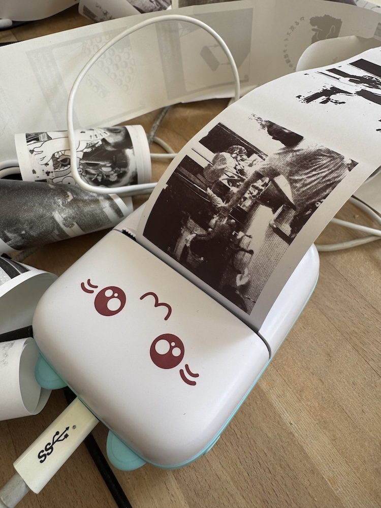

MXW01 BLE Thermal Cat-Printer
===================
This is [another] swift implementation of interfacing to the affectionatly known Cat-Printers.

Developer Notes
------------------
The printers have a greyscale/hd mode of 4bpp `0x02`, but this is tricky to get working.
After using apple's `PacketLogger.app` (From XCode additional tools) I could sniff the 
BLE packets for the truly awful "official" app `Fun Print`.
- The print command packet MUST end with `0x00` instead of `0xff` for 4bpp mode. `0xff` works fine for 1bpp
- Max MTU is 182 bytes
- Checksum seems irrelevent?
